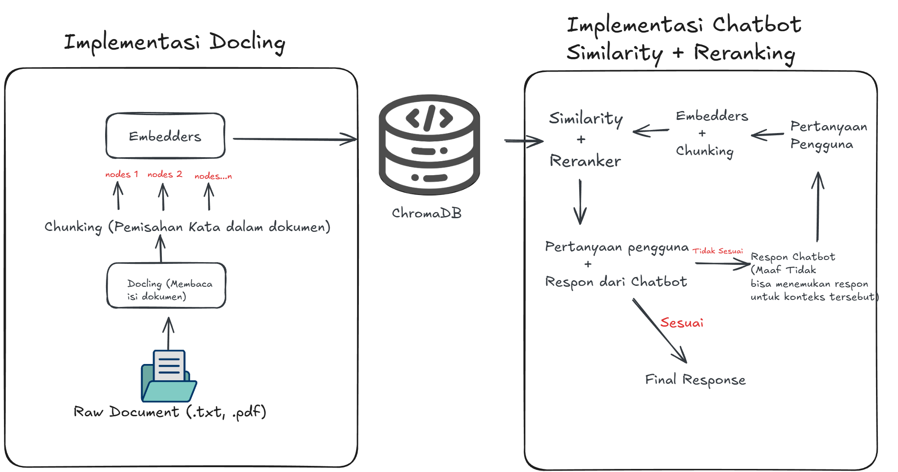

# RAG Local Implementasi Docling + LlamaIndex

**Aplikasi Ini Berjalan 100% Local Sehingga Aman untuk Data/Dokumen yang Private**

# **1. Demo Aplikasi RAG**

# **2.STRUKTUR Folder Projek Ini**
├── ingestion/
│   ├── ingest.py          # Script utama untuk membaca & menyimpan dokumen (Docling)
│   ├── chunker.py         # Logika pemotongan teks (Chunking)
│   └── embedder.py        # Logika embedding ke ChromaDB
├── utils/
│   ├── db.py              # Konfigurasi path database
│   └── providers.py       # Konfigurasi nama model LLM
├── source_data/           # Tempat menaruh file PDF/TXT input
├── chroma_db/             # Folder penyimpanan Vector Database (Otomatis dibuat)
├── rag_main.py            # Aplikasi Chatbot (Streamlit UI & RAG Pipeline)
├── requirements.txt       # Daftar library Python
└── README.md              # Dokumentasi ini

# **3. Workflow**

# **4.Fitur Utama Yang Digunakan**
* **Advanced Parsing:** Menggunakan **Docling (IBM)** untuk membaca PDF, mengekstrak tabel ke Markdown, dan melakukan OCR pada gambar secara otomatis.
* **Smart Retrieval:** Menggunakan **Re-Ranking (BGE-Reranker)** untuk menyaring hasil pencarian agar konteks yang diberikan ke LLM sangat akurat.
* **Local Privacy:** Menggunakan **Ollama** untuk menjalankan LLM (`llama3:instruct`) dan Embedding (`nomic-embed-text`) secara lokal tanpa internet.
* **GPU Accelerated:** Mendukung akselerasi CUDA untuk proses Ingestion (OCR) dan Querying.
* **Conversational Memory:** Chatbot mengingat konteks percakapan sebelumnya.

# **5. Teknologi Yang Digunakan**
* **Framework** : **Python Versi 3.10.x, LLamaIndex, Streamlit**
* **LLM & Embeddings**: **llama3:instruct & nomic-embed-text**
* **Parsing Dokumen** : **Docling (IBM)**
* **Database Vector** : **ChromaDB**

# **6. Rekomendasi Hardware**
* **RAM** : Minimal 16 GB (32 GB Disarankan)
* **GPU** : NVIDIA dengan VRAM minimal 6GB
* **Storage** : ~5GB untuk model AI